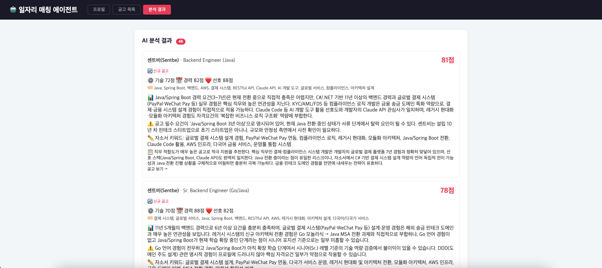
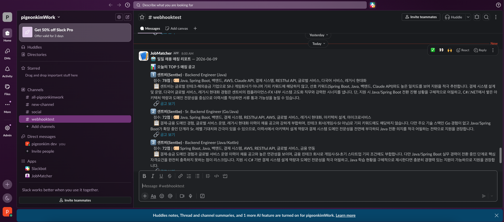

# Job Matcher Agent

채용 공고를 매일 자동으로 긁어와서 Claude로 내 이력서랑 매칭해보고,
괜찮은 공고를 아침에 슬랙으로 받아보는 도구입니다.

C#만 11년 하다가 Java/Spring으로 넘어오는 중인데, 새 스택은 직접 매일 쓰는 걸
하나 만들어보는 게 제일 빨리 익는 것 같아서 시작했습니다. 지금도 매일 돌리고 있어요.

## 어떻게 동작하나

1. 프로필에 이력서랑 검색 키워드(예: `Spring Boot, Java 백엔드`)를 넣어둡니다.
2. 스케줄러가 하루 5번 그 키워드로 공고를 긁어옵니다.
3. Claude가 공고마다 기술/경력/선호도 점수를 매기고, 우려되는 점이랑 자소서에 쓸
   키워드까지 뽑아줍니다.
4. 점수 높은 순으로 매일 아침 8시에 슬랙으로 정리해서 보내줍니다.
5. 결과에서 관심있음/관심없음/지원함을 눌러두면 다음 분석 때 그 성향을 반영합니다.

이미 분석한 공고는 프로필이 바뀌었거나 새 공고일 때만 다시 분석합니다. (Claude 호출
비용을 아끼려고요.)

## 만들면서 신경 쓴 부분

- **응답 파싱.** 처음엔 Claude 응답을 정규식으로 잘라서 `Map`으로 받았는데, 형식이
  조금만 달라도 터졌습니다. anthropic-java SDK의 structured outputs로 바꿔서 응답을
  record 타입으로 강제 파싱하게 했어요.
- **트랜잭션 경계.** 재분석할 때 기존 결과 삭제 + 새로 저장이 한 트랜잭션으로 묶이도록
  서비스로 분리했습니다. (사실 원래는 private 메서드에 `@Transactional`이 붙어 있어서
  적용이 안 되고 있었습니다...)
- **외부 API 장애.** 원티드/Claude 호출에 재시도(Resilience4j)를 걸고, 공고 한 건이
  실패해도 전체 배치가 멈추지 않게 격리했습니다.
- **테스트.** 단위 + 컨트롤러 슬라이스(`@WebMvcTest`) + WireMock(외부 API 스텁) +
  Testcontainers(실제 PostgreSQL) + 스모크. 외부 API를 직접 치지 않고 결정적으로
  돌아가게 했습니다.

## 기술 스택

| | |
|---|---|
| Backend | Spring Boot 4.0.6, Java 17, JPA/Hibernate |
| Database | PostgreSQL 15 |
| AI | Claude API (`claude-sonnet-4-6`), anthropic-java SDK |
| 크롤링 | Jsoup, 원티드 API |
| 회복탄력성 | Resilience4j (retry) |
| 알림 | Slack Incoming Webhook |
| 테스트 | JUnit 5, Mockito, Testcontainers, WireMock, JaCoCo |
| 빌드 | Gradle (Groovy) |

## 실행

PostgreSQL이 먼저 떠 있어야 합니다 (기본값: `jdbc:postgresql://localhost:5432/job_matcher_agent`).

```bash
export MY_ANTHROPIC_API_KEY=your_api_key
export SLACK_WEBHOOK_URL=your_webhook_url

./gradlew bootRun
```

테스트는 `./gradlew test`. Testcontainers를 쓰는 통합 테스트는 Docker가 있어야 돌고,
없으면 자동으로 건너뜁니다.

## API

| Method | URL | 설명 |
|---|---|---|
| GET | `/api/profile` | 프로필 조회 |
| PUT | `/api/profile` | 프로필 수정 |
| GET | `/api/postings` | 수집된 공고 목록 |
| POST | `/api/crawl` | 공고 수집 (프로필 검색 키워드 사용) |
| POST | `/api/analyze` | AI 분석 (변경된 것만 재분석) |
| GET | `/api/results` | 분석 결과 + 현재 피드백 |
| POST | `/api/feedback/{matchResultId}` | 피드백 저장 (공고당 1개) |
| GET | `/api/feedback` | 타입별 피드백 조회 |

## 아직 못 한 것 / 한계

- 아직 1인용입니다. 프로필 id를 `1`로 하드코딩해 뒀어요.
- 원티드 한 곳만 긁어옵니다. 비공식 API + Jsoup이라 사이트 구조가 바뀌면 깨질 수 있고,
  사람인/점핏 추가는 나중에 생각하고 있습니다.
- Docker 구성이랑 CI, Actuator 모니터링은 아직 안 붙였습니다.

## 스크린샷

### 분석 결과 화면


### Slack 일일 리포트

